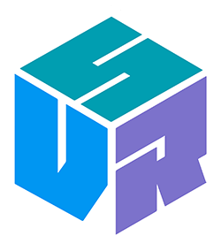

# Seattle VR

Welcome to the Seattle VR Github! Here you'll find information on the group, events we have planned, ways to contribute, and other information for the Seattle VR Meetup groups. 

If you notice an error or have a suggestion feel free to send us a PR or connect with us another way:

- [Facebook](https://www.facebook.com/groups/seattlevrar/)
- [Twitter](https://twitter.com/seattlevr)
- [Slack](http://bit.ly/SeattleVRSlackSubscribe)
- [General@seattle-immersive.com](mailTo:general@seattle-immersive.com)
  
### **[2018 Community Survey Results](community-survey/2018/)**

## Event Specific Information

- [Code of Conduct](code-of-conduct.md)
- [Seattle VR: Demo Nights](demo-nights/)
- [Seattle VR: Panels and Presentations](panels-and-presentations/)
- [Seattle VR: Hackathons](hackathon/)

## Getting involved

- [Looking to demo](demoing.md)
- [Looking to speak](call-for-speakers.md)
- [Looking to volunteer](volunteering.md)
- [Looking to sponsor](sponsorship.md)
- [Looking to host](hosting.md)

Shout out to :point_right:[Seattle JS](https://github.com/seattlejs/seattlejs) :raised_hands: for the docs inspiration!
