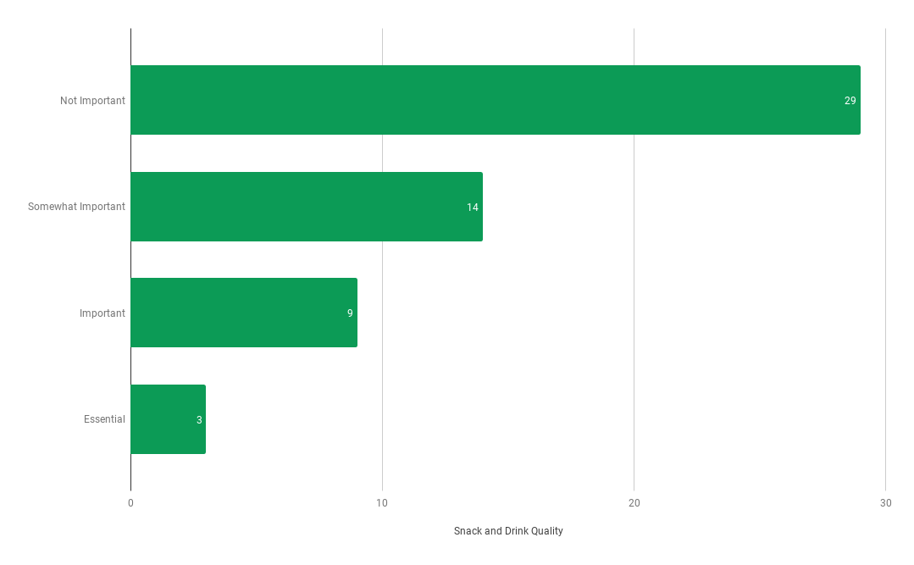
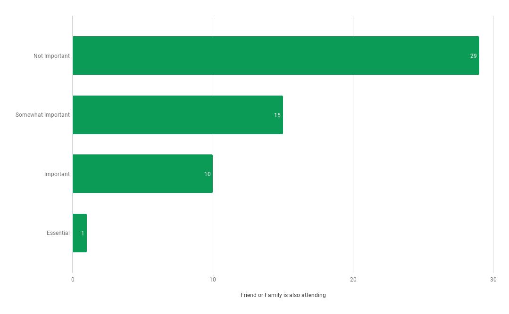
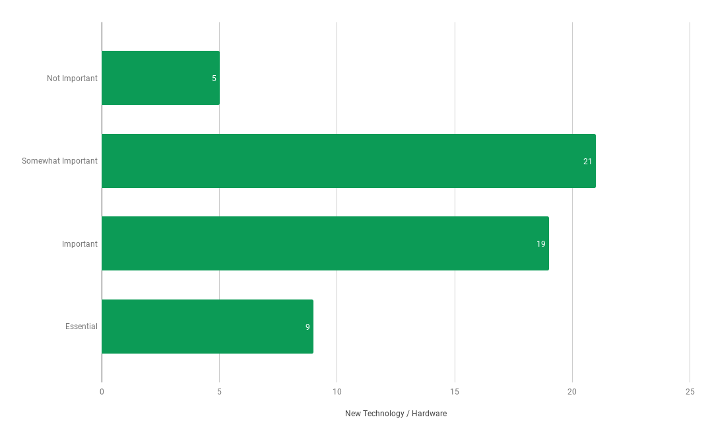
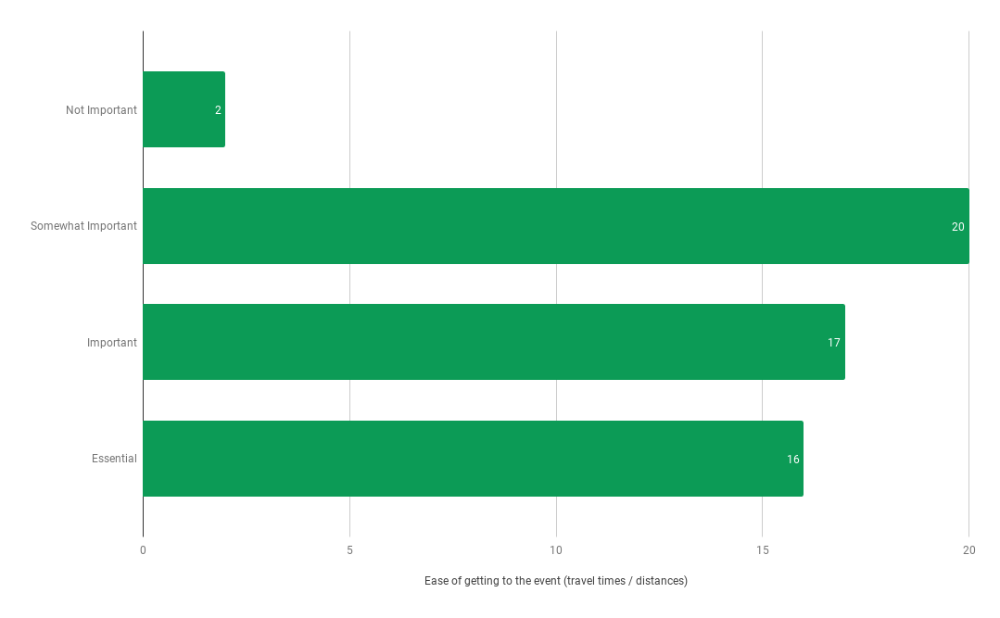
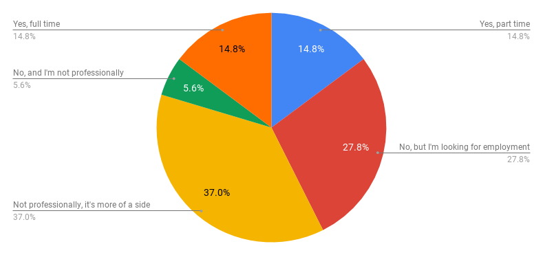

# Seattle VR 2018 Community Survey Results/Review
A massive thank you to everyone who took the time to fill out our 2018 Community Survey. Feedback like this is invaluable as we work to serve the community as best was we can. And we thought we'd go question by question and analyze some takeaways from your feedback and suggestions.

Thanks so much again for the feedback, and for being an absolutely amazing community! :heart_eyes:

## Table of Contents
- [Seattle VR 2018 Community Survey Results/Review](#seattle-vr-2018-community-survey-resultsreview)
    - [1) What types of events do you regularly attend / follow?](#1-what-types-of-events-do-you-regularly-attend--follow)
    - [2) Please rate how important each item is on determining your attendance of any given meetup](#2-please-rate-how-important-each-item-is-on-determining-your-attendance-of-any-given-meetup)
        - [a. Community Engagement and Networking Opportunities](#a-community-engagement-and-networking-opportunities)
        - [b. The Planned Demos and Experiences](#b-the-planned-demos-and-experiences)
        - [c. Snack and Drink Quality](#c-snack-and-drink-quality)
        - [d. Friend or Family is also attending](#d-friend-or-family-is-also-attending)
        - [e. Meetup Theme](#e-meetup-theme)
        - [f. New Technology / Hardware](#f-new-technology--hardware)
        - [g. Parking Availability](#g-parking-availability)
        - [h. Bike/Transit Options](#h-biketransit-options)
        - [i. Merch / Swag / Giveaways](#i-merch--swag--giveaways)
        - [j. The Number of Things to Do / Try](#j-the-number-of-things-to-do--try)
        - [k. Ease of getting to the event (travel times / distances)](#k-ease-of-getting-to-the-event-travel-times--distances)
    - [3) What is your favorite thing about attending Seattle VR events? (ie. why do you attend our events?)](#3-what-is-your-favorite-thing-about-attending-seattle-vr-events-ie-why-do-you-attend-our-events)
    - [4) What is your least favorite thing about attending Seattle VR events? (ie what deters you from attending events?)](#4-what-is-your-least-favorite-thing-about-attending-seattle-vr-events-ie-what-deters-you-from-attending-events)
    - [5) How do you stay up to date with Seattle VR events?](#5-how-do-you-stay-up-to-date-with-seattle-vr-events)
    - [6) What suggestions and ideas do you have for us? What can we do better for you?](#6-what-suggestions-and-ideas-do-you-have-for-us-what-can-we-do-better-for-you)
        - [Improve Organizer/Volunteer visibility](#improve-organizervolunteer-visibility)
        - [An Official Suggestion Box (digital or otherwise)](#an-official-suggestion-box-digital-or-otherwise)
        - [Better communication / More frequent updates](#better-communication--more-frequent-updates)
        - [Shorter lines/wait times](#shorter-lineswait-times)
        - [More industry representation](#more-industry-representation)
        - [Industry Stickers/Identifiers (Artist, Sound Designers, Programmers, Business folks, makers/hobbyists, experience levels)](#industry-stickersidentifiers-artist-sound-designers-programmers-business-folks-makershobbyists-experience-levels)
    - [7) Are you employed in immersive tech?](#7-are-you-employed-in-immersive-tech)
    - [Call for Volunteers](#call-for-volunteers)

## 1) What types of events do you regularly attend / follow?

This question gives us an idea of our event sizes relative to each other but more valuably it provides a frame for rest of the questions. Giving a better understanding of the communities being represented by the responses.

## 2) Please rate how important each item is on determining your attendance of any given meetup

Easily the most informative question, we can learn the community's priorities:
- Community engagement and networking is extremely important.
- Knowing details on the planned demos/activities/experiences is much more important than knowing the over all event theme.
- People are self-motivated in their attendance and not attending just because someone else is attending.
- Everyone likes new hardware but it's not vital to attendance.
- Snacks/merch aren't a priority.
- The ease of getting to an event/meetup is more important the method.

### a. Community Engagement and Networking Opportunities

### b. The Planned Demos and Experiences

### c. Snack and Drink Quality

### d. Friend or Family is also attending

### e. Meetup Theme

### f. New Technology / Hardware

### g. Parking Availability

### h. Bike/Transit Options

### i. Merch / Swag / Giveaways

### j. The Number of Things to Do / Try

### k. Ease of getting to the event (travel times / distances)

## 3) What is your favorite thing about attending Seattle VR events? (ie. why do you attend our events?)

Community, finding inspiration in each other's work, dope new tech, and keeping a pulse on the industry just about sums up the responses. And we couldn't agree more!

## 4) What is your least favorite thing about attending Seattle VR events? (ie what deters you from attending events?)

Feeling anxious in the crowd when trying to meet people, was easily the most common response. Which is great, you know... in a sense! If you're there to meet people and feeling anxious about saying hello, keep in mind that they're there to meet you too! But walking up to a stranger can be intimidating and we can work on finding more ways to get people talking to each other. 

Long lines, incomplete event info and travel/parking pains were some other common responses. Which can also be used as a conversation starter! :sweat_smile: We're listening and working on it I promise.

Also, the people who said "missing it" are hecka sweet. :heart_eyes: 

## 5) How do you stay up to date with Seattle VR events?

We're working on bettering our communication across all our platforms and working on getting a dedicated person for social media engagement.

So imma post a bunch of links here.... no reason... but dang do they look clickable :smirk:
- [Demo Nights](../demo-nights/)
- [Panels and Presentations](../panels-and-presentations/)
- [Hackathons](../hackathon/)
- [Facebook Group](https://www.facebook.com/groups/1457926677836973/)
- [Twitter](https://twitter.com/seattlevr)
- [Slack](https://join.slack.com/t/seattlevr/shared_invite/enQtNDEzNjQzNzUyODY1LWY2YTZiZDUxN2EwMTZiNDliMzBlZTM2YzlmODE4MjE0YmNhNjhhYjkyNGRjZWJmM2E3NzhhM2NiNjFkYTY4YmU)

## 6) What suggestions and ideas do you have for us? What can we do better for you?
 
### Improve Organizer/Volunteer visibility

>"I'd appreciate a little more structure or maybe a few hosting reps who were really visible and able to talk to me. I've shown up as a total newbie on my own and it was pretty alienating/overwhelming."

We're working on some ideas for making it a little more obvious who's who during a meetup/event.

### An Official Suggestion Box (digital or otherwise)

>"take suggestions for meetup content ideas"

We'll see about setting up an official feedback/suggestion process. As it stands though, you can always email, tag, dm, tweet, message, or carrier pigeon us your ideas and suggestions. We love getting outside input!

### Better communication / More frequent updates

>"I think just spending more time to really craft the topic and have a nice summary that says what exactly is going on when. An agenda, a write up on the topic, a write up on each speaker, a write up about each demo, etc. Tell us what will be shown, who will be there and speaking."

We got a lot of similar sentiments and a lot of suggestions for things we're already doing (talks, fireside chats, collaborative projects). Which further suggests to me that we could do better promoting, cross-promoting, and summarizing our events.

### Shorter lines/wait times

>"Numbered tickets so that I can reserve a spot and return. Every time experience is over whoever has smallest number gets to try next and ticket is taken from them."

>"Shorter lines for demos! I have no idea how you would do that, though…"

We're working hard to get the demo wait lines down. Luckily it's a good problem. A hard problem to solve, but a good one to have.

### More industry representation

>"Bring in more people from industry to give talks. So much platform VR stuff going on in Seattle."

>"Have some more big names attend!!!"

I mean... hell yeah!

### Industry Stickers/Identifiers (Artist, Sound Designers, Programmers, Business folks, makers/hobbyists, experience levels)

This was brought up a few times in various forms. We want to be careful though. Things like these can quickly devolve into a "we don't talk to orange badges" mentality. But at the same time we recognize how it'd be a lot less intimidating to walk up and introduce yourself to someone new, when you already know you have a shared interest in sound design, for example.

## 7) Are you employed in immersive tech?

We also got a fantastic variety in self-described job titles and congratulations to the person that just got hired at Oculus. :raised_hands:

## Call for Volunteers
We got a bunch of new people offering to volunteer and I just want to say thank you!!! We'll be in contact soon as we formalize our volunteer process. <3

And if you've read this far, thanks so much! We're so proud of this community, and we can't wait to get to work on supporting it the best that we can! :purple_heart: :heartbeat: :purple_heart:
